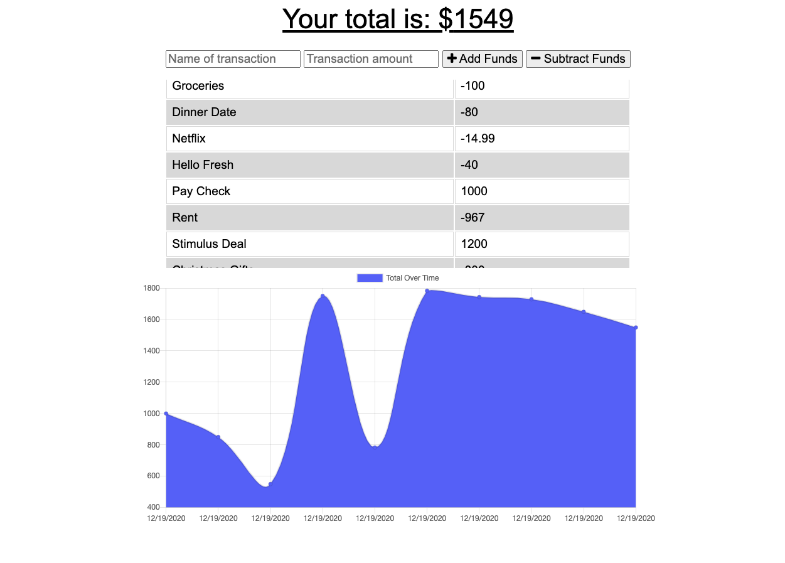

# budget-tracker

## Description

This weeks challenge was to use a provided starter code for a budget tracker application and implement offline connectivity as well as implement a service-worker. This application allows a user to input transactions that go on in their daily life in order to monitor their budget. However, if the user is experiencing poor internet connectivity there is nothing to worry about. Budget Tracker allows the users transactions to be stored and then uploaded once their internet connection has been properly restored. Users can also see all of their transactions in an easy to read chart.

## Table of Contents

* [Installation](#installation)
* [Usage](#usage)
* [License](#license)
* [Contributing](#contributing)
* [Links](#links)
* [Questions](#questions)

## Installation 

Run 'npm install' in the command line to install all the necessary dependencies if trying to run the app locally.

## Usage

To access this application simply navigate to https://stormy-everglades-39256.herokuapp.com/ and begin inputting your transactions!

## Licenses

* MIT

## Contributing

* Aaron Centeno

## Technologies Used
* Express
* Node Modules
* GitHub
* JavaScript
* Terminal
* MongoDB
* IndexedDB

## Screenshots

## Links

Live App: https://stormy-everglades-39256.herokuapp.com/
GitHub Repo: https://github.com/aaroncenteno/socialNet-workAPI

## Questions

Contact Information for questions: 

GitHub: [aaroncenteno](https://www.github.com/aaroncenteno) 

E-mail: asamcent@gmail.com